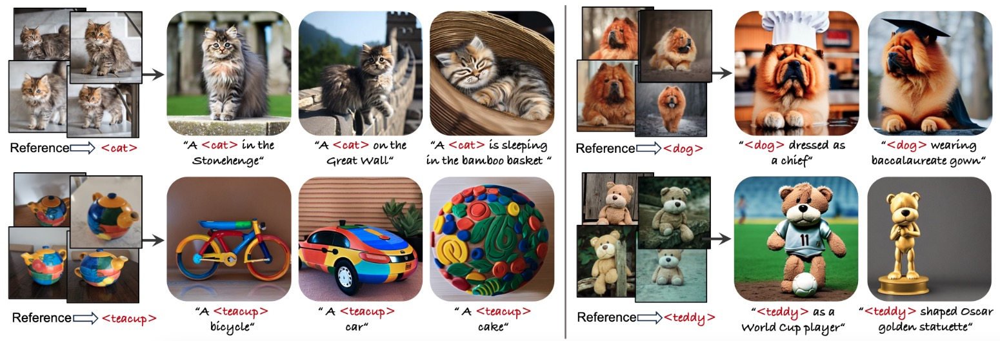

# CatVersion: Concatenating Embeddings for Diffusion-Based Text-to-Image Personalization

[](https://arxiv.org/abs/2311.14631) 

[[Project Website](https://royzhao926.github.io/CatVersion-page/)]


> Ruoyu Zhao<sup>1</sup>, Mingrui Zhu<sup>1</sup>, Shiyin Dong<sup>1</sup>,  Nannan Wang<sup>1</sup>, Xinbo Gao<sup>2</sup><br>
> <sup>1</sup>Xidian University, <sup>2</sup>Chongqing University of Posts and Telecommunications

>**Abstract**: <br>
> We propose CatVersion, an inversion-based method that learns the personalized concept through a handful of examples. Subsequently, users can utilize text prompts to generate images that embody the personalized concept, thereby achieving text-to-image personalization. In contrast to existing methods that emphasize word embedding learning or parameter fine-tuning, which potentially causes concept dilution or overfitting, our method concatenates embeddings on the feature-dense space of the text encoder in the diffusion model to learn the gap between the personalized concept and its base class, aiming to maximize the preservation of prior knowledge in diffusion models while restoring the personalized concepts. To this end, we first dissect the text encoder's integration in the image generation process to identify the feature-dense space. Afterward, we concatenate embeddings on the Keys and Values in this space to learn the gap between the personalized concept and its base class. In this way, the concatenated embeddings ultimately manifest as a residual on the original attention output. To more accurately and unbiasedly quantify the results, we improve the CLIP image alignment score based on masks. Qualitatively and quantitatively, CatVersion helps to restore personalization concepts more faithfully and enables more robust editing.


## Description
This is the official repository of the paper 
[CatVersion: Concatenating Embeddings for Diffusion-Based Text-to-Image Personalization](https://arxiv.org/abs/2311.14631)
## Updates

`01/01/2024` Code released!

## Getting Started
### preparation
* **Pre-trained model**: This code implementation is based on [SD v1.5](https://drive.google.com/file/d/1S6NZkMJCm8KVJ0ctbAdw_PAIoOZZh2n1/view?usp=sharing). Please put it to ''./models/sd/~.ckpt''
* **Environment**: Please reference *environment.yaml*

### test
Please run 
```
sh run.sh
```
or go to [./prompt-to-prompt_sd_attention_map.ipynb](prompt-to-prompt_sd_attention_map.ipynb)


### train

* **Initialization**:  Base class word initialization in "ldm/data/personalized.py" 
* **Run**:
```
python main.py --base configs/stable-diffusion/v1-finetune.yaml \
               -t \
               --actual_resume models/sd/v1-5.ckpt \
               -n cat \
               --gpus 0, \
               --data_root your/dataset/root \
```

## Citation
If you use this code or ideas from our paper, please cite our paper:
```
@misc{zhao2023catversion,
        title={CatVersion: Concatenating Embeddings for Diffusion-Based Text-to-Image Personalization}, 
        author={Ruoyu Zhao and Mingrui Zhu and Shiyin Dong and Nannan Wang and Xinbo Gao},
        year={2023},
        eprint={2311.14631},
        archivePrefix={arXiv},
        primaryClass={cs.CV}
  }
```

## Acknowledgments
This code borrows from [Textual Inversion](https://github.com/rinongal/textual_inversion), [Transformers](https://github.com/huggingface/transformers). Some snippets of colab code from [prompt-to-prompt](https://github.com/phymhan/prompt-to-prompt)